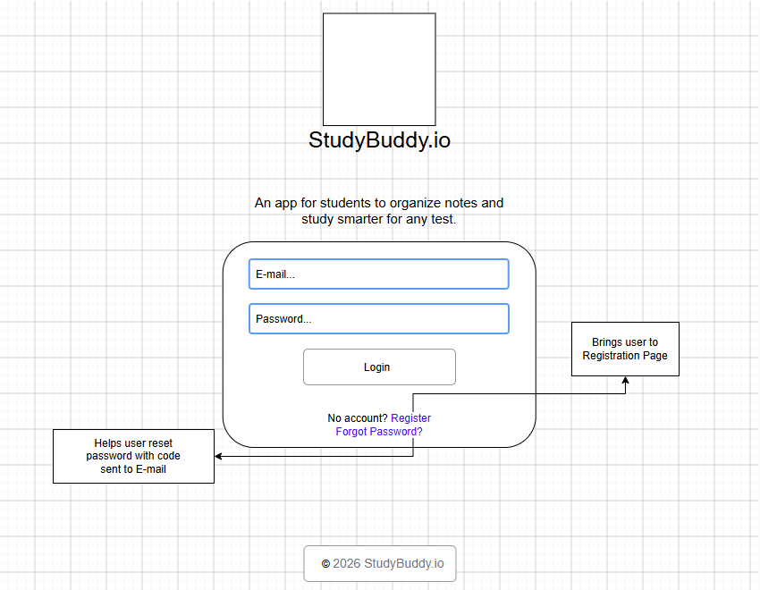
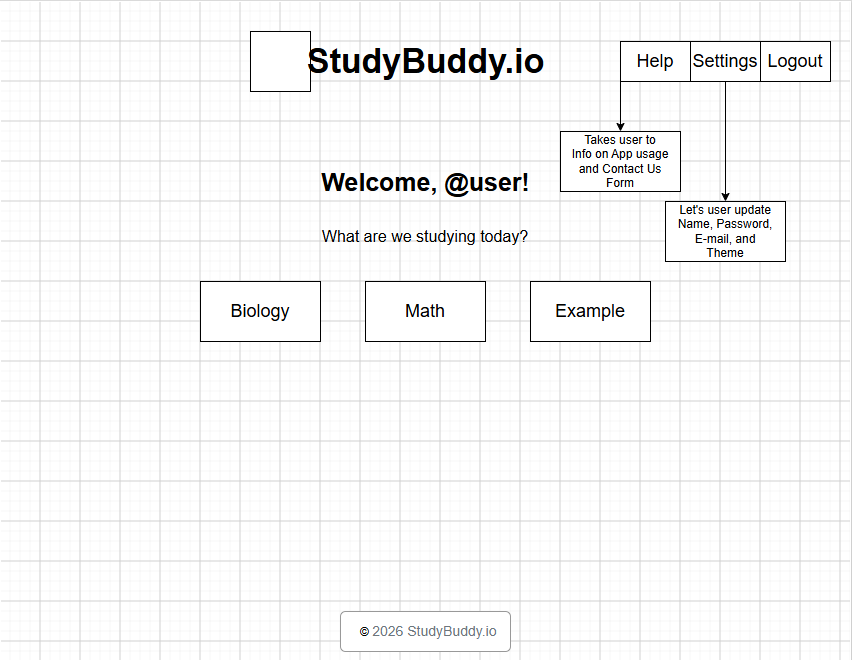
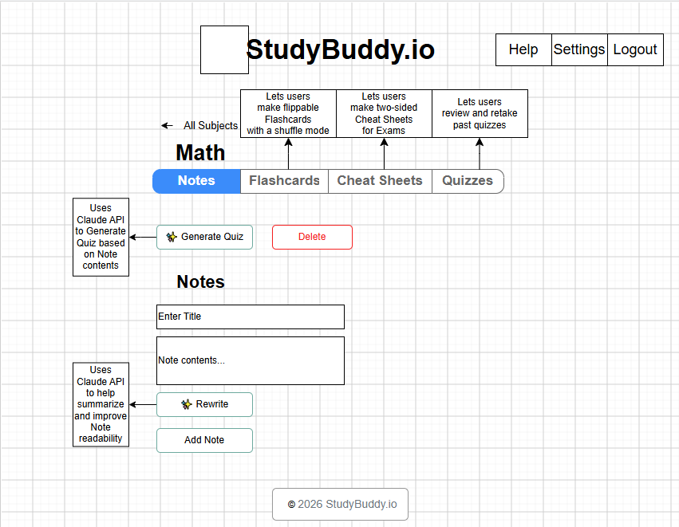
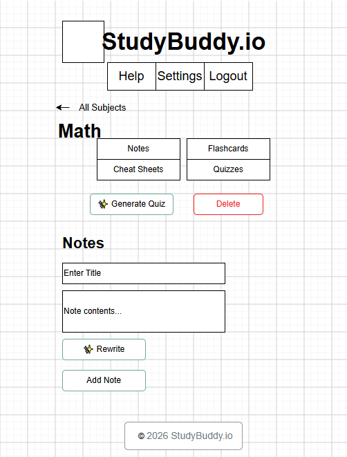
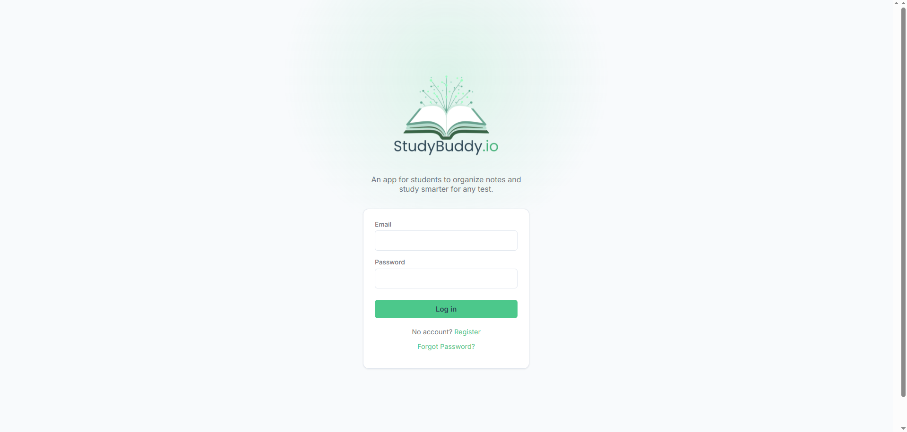
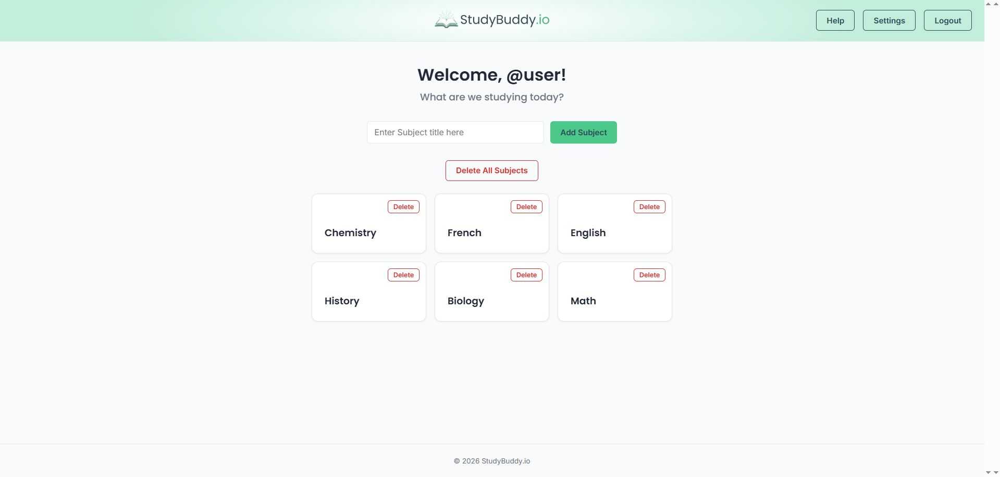
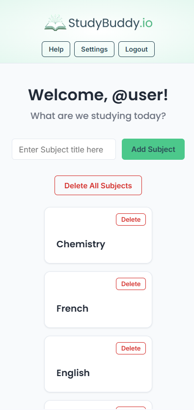
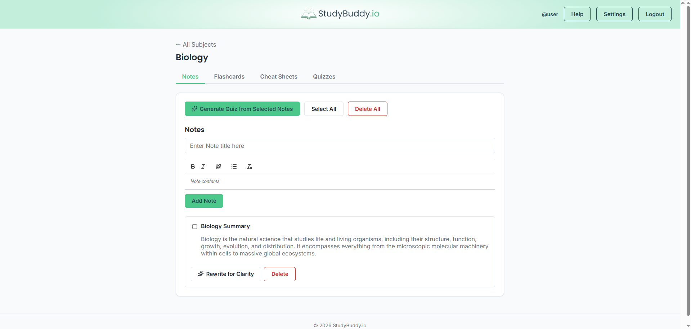
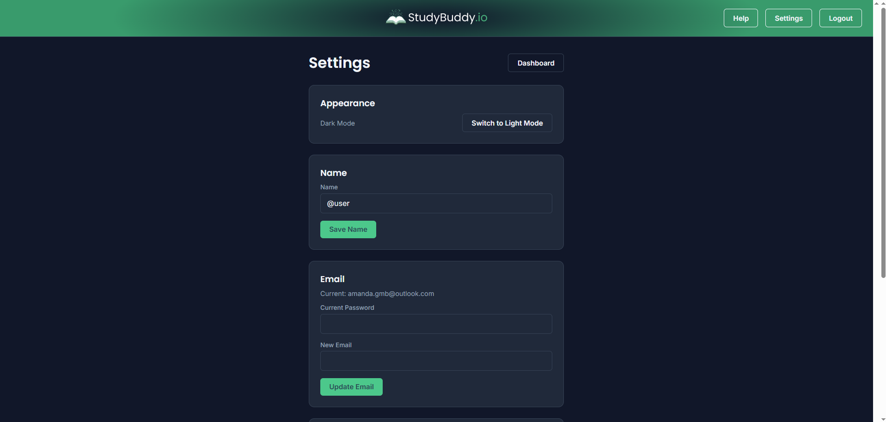

# 📚 StudyBuddy.io

## 📌 Overview

StudyBuddy.io is a full-stack MERN application built to help students organize their coursework and study more effectively. Users can create subjects, take rich-text notes, build flashcards, assemble two-sided cheat sheets, and generate AI-powered practice quizzes from their own material — all backed by secure, per-user authentication so every student's data stays private.

This project was built as a capstone for a Software Engineering bootcamp, with a required focus on integrating the Anthropic Claude API as a core feature rather than an afterthought.

---

## 🚀 Key Features

**Authentication & Accounts**
- Registration, login, and logout using JWT stored in httpOnly cookies (not localStorage)
- Protected routes and API endpoints — every resource is scoped to its owner
- Forgot Password flow with a 6-digit code emailed via Resend
- Settings page: update name, email (password-confirmed), and password (with repeat-password confirmation), plus a Dark Mode toggle

**Study Tools**
- **Subjects** — top-level organization for coursework, with a 30-character title cap
- **Notes** — rich-text editor (bold, italic, highlight, bullet lists) via Quill
- **Flashcards** — up to 15 per subject, 100 characters per side, with a Study Mode featuring a 3D flip animation, shuffle (Fisher-Yates), and next/previous navigation
- **Cheat Sheets** — up to 5 per subject, styled as a real two-sided (front/back) US Letter allowed-notes page
- **Quizzes** — past quizzes are saved per subject and can be retaken or reviewed (View Answers) with timestamps

**Other**
- Help page with usage guidance and an AI accuracy disclaimer
- Contact Us form (submissions stored in MongoDB for manual review/reply)
- Bulk delete actions with confirmation modals throughout
- Fade-in animations, dark mode, and a cohesive design system built on CSS custom properties

---

## 🤖 AI-Powered Features (Claude API)

StudyBuddy.io integrates the **Anthropic Claude API** in two distinct, purposeful ways — both implemented on the backend so the API key is never exposed to the browser.

### 1. Generate Quiz from Selected Notes
The user selects one or more notes. Their (HTML-stripped) content is sent to Claude with a structured prompt requesting a strict JSON response: five multiple-choice questions, each with four options, a correct-answer index, and an explanation. The response is parsed, validated, and saved to MongoDB, then rendered as an interactive quiz with instant right/wrong feedback and a running score.

### 2. Rewrite for Clarity
Available on both Notes and Cheat Sheet sides. The existing content is sent to Claude with instructions to rewrite it more clearly and concisely **without changing or adding any facts**. The result is shown in a before/after preview, and the user chooses to Apply (overwrite the original) or Discard.

Both features share the same API key, Anthropic SDK client, and error-handling pattern (missing key, rate limits, malformed responses).

---

## ✍ Wireframes (draw.io)

### Login Page


### Dashboard 


### Subject Page (Desktop)


### Subject Page (Mobile)


---

## 📸 Screenshots

### Login Page


### Dashboard (Desktop)


### Dashboard (Mobile)


### Subject Page


### Dark Mode


---

## 🧩 User Stories

- As a user, I want to create and save notes for study and test preparation on a given subject.
- As a user, I want to organize notes into different categories and subjects.
- As a user, I want to create flash cards to review my knowledge on a given subject.
- As a user, I want to generate pop quizzes to test my knowledge on a given subject.
- As a user, I want my notes to be summarized for improved readability.
- As a user, I want to protect and save my notes in a secure account.

---

## 🛠️ Tech Stack

### Frontend
- React 19 (Vite)
- React Router
- React Quill (`react-quill-new` fork, for React 19 compatibility)
- Axios
- Lucide React (icons)

### Backend
- Node.js + Express
- MongoDB + Mongoose (hosted on MongoDB Atlas)
- JWT (`jsonwebtoken`) + `bcryptjs` for auth
- Resend (HTTP-based email API) for password reset emails
- Anthropic SDK (`@anthropic-ai/sdk`) for Claude API integration

### Testing
- Jest + Supertest + `mongodb-memory-server` (backend API tests)

---

## ⚙️ Setup Instructions

### 1. Clone the repository
```bash
git clone https://github.com/your-username/CapstoneProject_StudyBuddy.io.git
cd CapstoneProject_StudyBuddy.io
```

### 2. Install backend dependencies
```bash
cd backend
npm install
```

### 3. Install frontend dependencies
```bash
cd ../frontend
npm install
```

### 4. Set up required accounts/keys
- **MongoDB Atlas** — create a free cluster and database user at https://www.mongodb.com/cloud/atlas
- **Anthropic API key** — create one at https://console.anthropic.com, and add billing credits (Settings → Plans & Billing)
- **Resend API key** — create a free account at https://resend.com and generate an API key (used to send password reset emails). Free tier: 3,000 emails/month, no credit card required.

### 5. Configure environment variables
Copy `backend/.env.example` to `backend/.env` and fill in your own values (see the **Environment Variables** section below).

---

## ▶️ How to Run the Backend

```bash
cd backend
npm run dev
```
Runs on `http://localhost:5000` by default. Confirm the terminal shows `MongoDB connected` and `Server running on port 5000`.

## ▶️ How to Run the Frontend

```bash
cd frontend
npm run dev
```
Runs on `http://localhost:5173` by default (Vite's default port). Open that URL in your browser.

Both servers need to be running simultaneously for the app to function — the frontend calls the backend's API for everything except static assets.

---

## 🔑 Environment Variables

These live in `backend/.env` (never committed — see `.env.example` for the template):

| Variable | Description |
|---|---|
| `MONGO_URI` | MongoDB Atlas connection string, including database name |
| `PORT` | Port the Express server runs on (default: 5000) |
| `JWT_SECRET` | Long random string used to sign/verify auth tokens |
| `NODE_ENV` | `development` or `production` (affects cookie security settings) |
| `CLIENT_URL` | The frontend's origin, for CORS (e.g. `http://localhost:5173`) |
| `ANTHROPIC_API_KEY` | Your Anthropic Console API key, for Claude API calls |
| `RESEND_API_KEY` | API key from your Resend account, for sending password reset emails |

---

## 📄 Full Project Documentation

A complete capstone documentation package — covering architecture, MongoDB schema design, the AI-powered feature explanation, testing methodology, and a summary of how AI was used during development — is available here:

[`docs/StudyBuddy_Capstone_Documentation.pdf`](./docs/StudyBuddy_Capstone_Documentation.pdf)

---

## 🌐 Deployment

🚧 *Deployment is in progress. Live links will be added here once the frontend and backend are deployed.*

- Frontend: [https://studybuddy-io.onrender.com]
- Backend API: [https://studybuddy-io-backend.onrender.com]

---

## 🧪 Testing

Backend routes are tested with **Jest**, **Supertest**, and **mongodb-memory-server** (a real, temporary MongoDB instance that runs in memory just for test runs, so tests never touch the production Atlas database).

### Running the tests
```bash
cd backend
npm test
```

### What's covered
- User registration validation (password length, duplicate email rejection)
- Login success/failure
- Subject and Note CRUD, including 30-character title limits
- **Ownership isolation** — verifying that one user can never read, edit, or delete another user's subjects or notes
- Cascade deletion (deleting a subject removes its notes)
- Bulk delete operations

### Test file structure
```
backend/
  tests/
    auth.test.js
    subjects.test.js
    notes.test.js
  test-utils/
    setupTestDB.js
```

---

## ♿ Accessibility

StudyBuddy.io was built with WCAG 2.1's **POUR Principles** (Perceivable, Operable, Understandable, Robust) in mind, targeting solid **Level A** compliance with several **Level AA** practices layered in. This was **not** independently audited by a professional accessibility reviewer — it reflects a deliberate, documented effort during development, not a certification.

**Implemented:**
- **Perceivable** — Fixed a failing primary-button contrast ratio (was ~2.1:1, now ≈4.5:1, meeting AA for normal text). Quiz right/wrong feedback uses ✓/✗ symbols alongside color, not color alone.
- **Operable** — All custom interactive elements (flashcard flip, subject cards) support full keyboard operation (Tab, Enter, Space), not just mouse clicks. The confirmation modal supports Escape-to-close and sensible default focus.
- **Understandable** — Every form field has a properly associated `<label htmlFor>`/`id` pair (including visually-hidden labels where the visual design uses a placeholder instead), so screen readers always have a real accessible name for each input. Character-limit counters use `aria-live` to announce updates as the user types.
- **Robust** — Decorative icons are marked `aria-hidden`. The confirmation modal uses `role="dialog"` and `aria-modal`. The Cheat Sheet's rich-text regions use `role="group"`/`aria-labelledby` to associate each editor with its heading.

**Known limitations:** 
- the Quill rich-text editor's placeholder text is CSS-based rather than a native HTML `placeholder` attribute, so it is not reliably announced by all screen readers as a field label. This is a third-party library constraint rather than an oversight, and is documented here rather than silently left unaddressed.
- Note formatting uses Quill, which has a known unpatched XSS advisory (CVE-2025-15056) in its HTML handling. Low risk in this single-user context; would require DOMPurify sanitization before any multi-user note-sharing feature. 

---

## 🔮 Future Improvements

- **Language setting** — allow users to select a display language (i18n)
- **Additional color themes** — beyond light/dark mode, let users switch the accent color (blue, red, orange, etc.)
- **Frontend component tests** with Vitest (Jest-compatible, built for Vite projects)
- **Spaced repetition** scheduling for flashcard review, rather than simple shuffle
- **Export Cheat Sheets to PDF** for printing
- **Shared/collaborative subjects** between multiple users
- **In-app admin reply** to Contact Us messages (currently handled manually via the submitter's stored email)
- **Full professional accessibility audit** (axe DevTools / Lighthouse) to formally verify AA/AAA conformance

---

## 🤝 How AI Was Used During Development

This project was built collaboratively with Claude (Anthropic) acting as a pair-programming partner and tutor throughout development, rather than generating the app in one pass. AI assistance was used to:

- Scope the project and identify a single, well-defined AI feature appropriate for the assignment
- Generate and explain backend/frontend code iteratively, one feature at a time, with each piece tested before moving on
- Debug real issues as they came up (CORS misconfiguration, Mongoose middleware version incompatibilities, environment variable mismatches, Gmail SMTP authentication failures, flexbox layout bugs)
- Explain *why* fixes worked, not just provide code — including security concepts (httpOnly cookies, ownership checks, password reset token design) and CSS root causes (flex `min-width` behavior, scrollbar layout shift)
- Review and refine UI/UX decisions (navigation structure, accessibility, dark mode theming)
- Set up and write a Jest test suite

All code was reviewed, tested, and approved by the developer at each step rather than accepted blindly — this README itself documents that iterative process.

---

## 📂 Project Structure

```
CapstoneProject_StudyBuddy.io/
│── docs/
│   └── StudyBuddy_Capstone_Documentation.pdf
│── backend/
│   ├── tests/
│   ├── test-utils/
│   ├── config/
│   │   └── db.js
│   ├── middleware/
│   │   └── auth.js
│   ├── models/
│   │   ├── User.js
│   │   ├── Subject.js
│   │   ├── Note.js
│   │   ├── Flashcard.js
│   │   ├── Cheatsheet.js
│   │   ├── Quiz.js
│   │   ├── Rewrite.js
│   │   ├── PasswordResetCode.js
│   │   └── ContactMessage.js
│   ├── routes/
│   │   ├── authRoutes.js
│   │   ├── subjectRoutes.js
│   │   ├── noteRoutes.js
│   │   ├── flashcardRoutes.js
│   │   ├── cheatsheetRoutes.js
│   │   ├── quizRoutes.js
│   │   ├── rewriteRoutes.js
│   │   └── contactRoutes.js
│   ├── utils/
│   │   └── mailer.js
│   ├── .env.example
│   └── server.js
│
│── frontend/
│   ├── public/
│   │   └── logos/
│   ├── src/
│   │   ├── api/
│   │   │   └── axios.js
│   │   ├── components/
│   │   ├── context/
│   │   │   ├── AuthContext.jsx
│   │   │   └── ThemeContext.jsx
│   │   ├── pages/
│   │   ├── App.jsx
│   │   └── index.css
│   └── index.html
│
└── README.md
```

---

## 👤 Author

Amanda McIntire

---

## 📄 License

This project was created as part of a Software Engineering Bootcamp Capstone and is intended for educational and portfolio purposes.